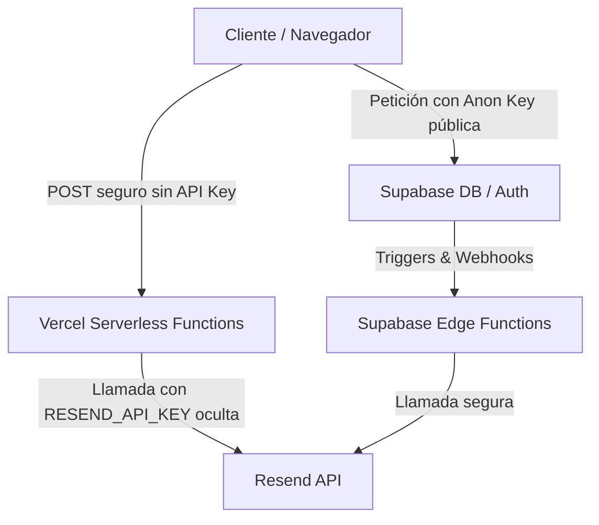

# SRX Tech Ecommerce

Una aplicación de comercio electrónico moderna construida con React, Vite, Supabase y varias bibliotecas modernas.

## 🚀 Demo en vivo

La aplicación está desplegada en GitHub Pages: [https://TheYafar.github.io/SRX-Tech-Ecommerce](https://TheYafar.github.io/SRX-Tech-Ecommerce)

## ✨ Características

- **Diseño moderno y responsive** - Interfaz de usuario atractiva y adaptable a todos los dispositivos
- **Autenticación de usuarios** - Sistema de registro e inicio de sesión con Supabase Auth
- **Carrito de compras** - Gestión completa de productos en el carrito
- **Lista de deseos** - Funcionalidad para guardar productos favoritos
- **Modal de detalles de producto** - Vista detallada de cada producto
- **Checkout** - Proceso de pago con múltiples métodos (Zelle, Pago Móvil, Binance Pay, etc.)
- **Notificaciones** - Sistema de notificaciones en tiempo real
- **Animaciones** - Transiciones suaves con Framer Motion

## 🛠️ Tecnologías utilizadas

- **React 19** - Biblioteca principal para la interfaz de usuario
- **Vite** - Herramienta de construcción rápida
- **Supabase** - Autenticación, Base de datos en tiempo real y Almacenamiento
- **Resend** - Proveedor seguro de envío de correos electrónicos
- **React Router DOM** - Enrutamiento de la aplicación
- **Framer Motion** - Animaciones y transiciones
- **React Hook Form** - Manejo de formularios
- **Zod** - Validación de esquemas
- **Lucide React** - Iconos modernos

## 🔒 Configuración de Seguridad y Arquitectura

Para proteger la infraestructura de la tienda y evitar ataques comunes de robo de credenciales, el proyecto implementa un modelo de arquitectura de seguridad de tres capas:



### 1. Protección de API Keys (Resend API)
*   **Vulnerabilidad corregida:** Anteriormente, la API Key de Resend se llamaba directamente desde el frontend mediante variables con el prefijo `VITE_`, lo cual exponía la clave privada en los bundles compilados del navegador.
*   **Arquitectura actual:** El frontend **nunca** realiza llamadas directas a Resend. En su lugar, el cliente invoca la función serverless local a través de `/api/send-email`. Es el servidor el que inyecta de forma segura `process.env.RESEND_API_KEY` (sin el prefijo `VITE_`) para interactuar con Resend.
*   **Servicio centralizado:** El backend unifica el envío bajo múltiples plantillas HTML según la acción requerida (`welcome-coupon`, `payment-verified`, `order-ready`).

### 2. Sincronización del cliente Supabase
*   El cliente Supabase en `src/utils/supabaseClient.js` está configurado para buscar dinámicamente `VITE_SUPABASE_PUBLISHABLE_KEY` (alineado con el archivo `.env`), soportando fallbacks de compatibilidad para evitar interrupciones en el entorno local o de producción.

### 3. Recomendaciones obligatorias de seguridad en base de datos (Supabase RLS)
Para evitar modificaciones maliciosas en compras, cupones u órdenes directamente desde el cliente:
*   **Activar Row Level Security (RLS)** en todas las tablas (`profiles`, `coupons`, `orders`, `payments`, `products`).
*   **Políticas de Seguridad Recomendadas:**
    *   `profiles`: Lectura y actualización solo permitida al propietario de la sesión. El campo `role` no debe ser modificable desde el cliente.
    *   `coupons`, `products` y `banners`: Lectura pública (`SELECT`). Edición y creación (`INSERT`, `UPDATE`, `DELETE`) restringidas únicamente a usuarios con rol `admin`.
    *   `payments` y `orders`: Creación libre para usuarios registrados. Cambios de estado (`status`) bloqueados a usuarios normales y permitidos solo para administradores.

## 📦 Instalación y ejecución local

1. Clona el repositorio:
```bash
git clone https://github.com/TheYafar/SRX-Tech-Ecommerce.git
cd SRX-Tech-Ecommerce
```

2. Instala las dependencias:
```bash
npm install
```

3. Crea un archivo `.env` en la raíz del proyecto basándote en la siguiente plantilla:
```env
VITE_SUPABASE_URL=https://tu-proyecto.supabase.co
VITE_SUPABASE_PUBLISHABLE_KEY=tu-clave-publica-anon
RESEND_API_KEY=tu-clave-privada-resend  # Solo se expone y lee en el servidor (Serverless Functions)
```

4. Ejecuta el servidor de desarrollo:
```bash
npm run dev
```

5. Abre [http://localhost:5173](http://localhost:5173) en tu navegador.

## 🚀 Despliegue

La aplicación está configurada para desplegarse automáticamente en GitHub Pages. Para desplegar manualmente la interfaz:

```bash
npm run deploy
```

> [!IMPORTANT]
> Recuerda configurar las variables de entorno de producción (`RESEND_API_KEY`, `SUPABASE_URL` y `SUPABASE_PUBLISHABLE_KEY`) en tu panel de control de Vercel (o tu proveedor serverless) para que los flujos de correo funcionen correctamente.

## 📁 Estructura del proyecto

```
├── api/               # Funciones serverless del backend (Vercel)
│   └── send-email.js  # Lógica unificada y segura de envío de correos
├── supabase/          # Lógica y Edge Functions de Supabase
│   ├── config.toml
│   └── functions/     # Edge functions (Deno Deploy)
├── src/               # Código fuente del frontend (React)
│   ├── components/    # Componentes reutilizables
│   ├── context/       # Contextos de React (Auth, Cart, etc.)
│   ├── pages/         # Páginas de la aplicación (Públicas y Admin)
│   ├── layouts/       # Layouts principales (Main, Admin)
│   ├── hooks/         # Hooks personalizados
│   ├── services/      # Servicios de consumo de API (emailService, couponService)
│   ├── data/          # Datos estáticos y mocks
│   ├── styles/        # Estilos globales y variables CSS
│   └── utils/         # Utilidades (cliente Supabase)
```

## 📄 Licencia

Este proyecto está bajo la licencia MIT.
